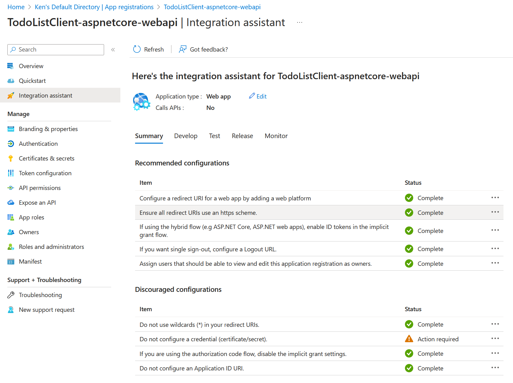
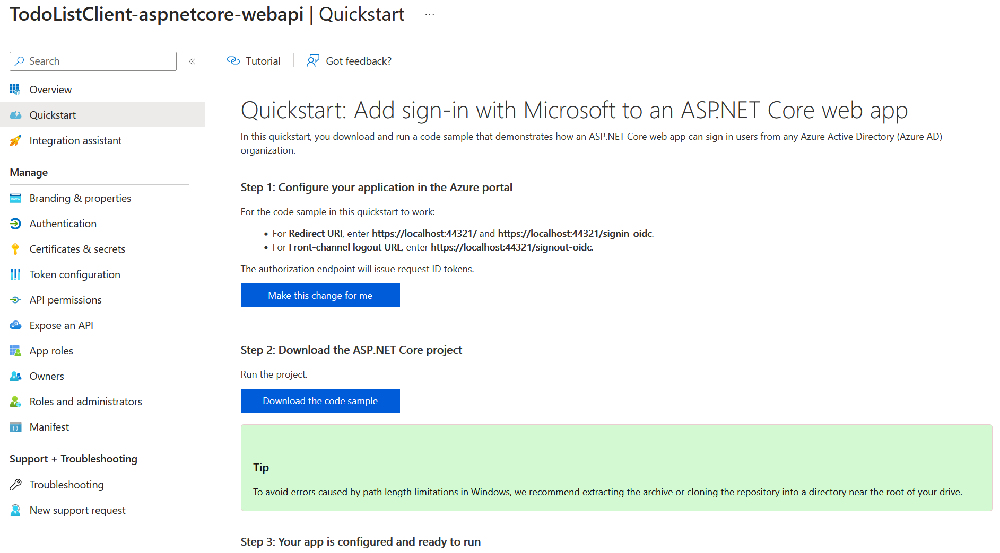
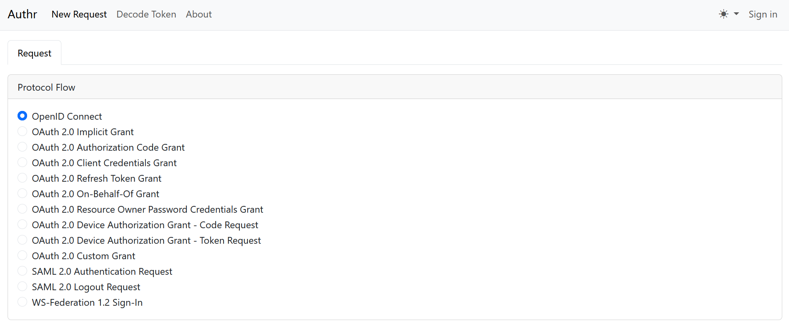
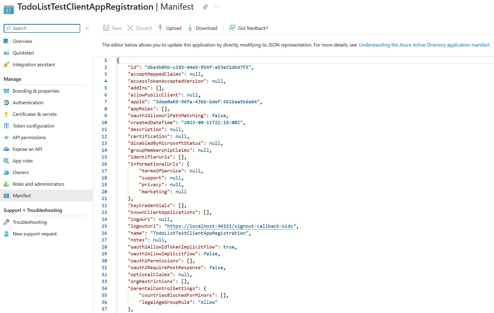
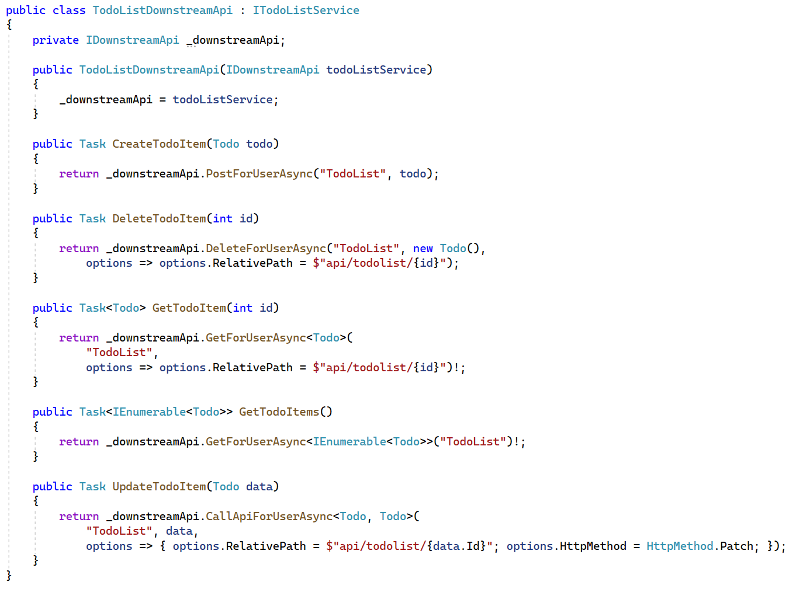
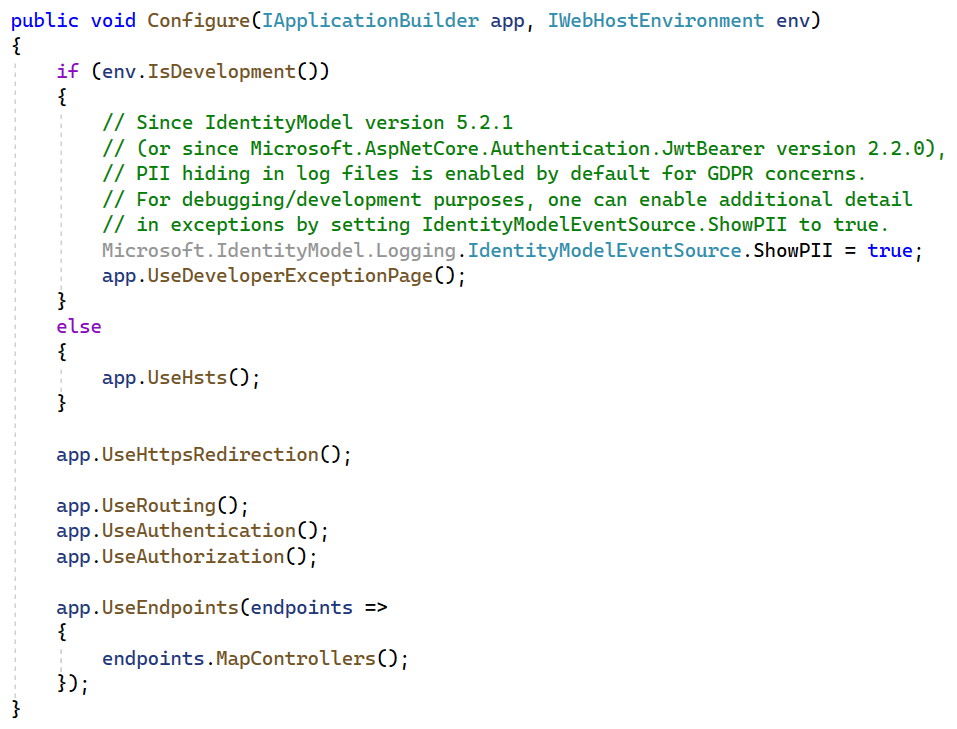
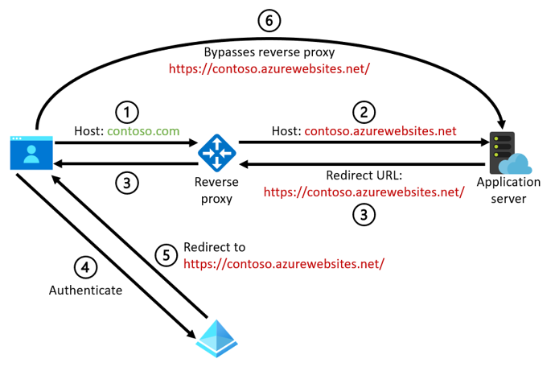

# Azure AD for devs - a primer
Learn about Azure AD - Microsoft's cloud-scale identity platform. It can be tricky to figure out how auth works, but once you know it's a powerful tool in your toolbox. In this repository we'll learn how it's done in a .NET web app. We'll discover what app registrations are, why we need one and how to wire up auth between a web app and an API backend.

## Getting Started
Run the app and observe the CRUD operations for TodListClient a .NET 7 ASP.NET Core MVC web app with a Web API backend that uses an in-memory dataset.

1. Set multiple startup projects

    

    https://learn.microsoft.com/en-us/visualstudio/ide/how-to-set-multiple-startup-projects?view=vs-2022

1. Start the solution and view the TodoList page

    

    You are now ready to use the demo script to learn about Azure AD App Registrations and the code changes needed to bring auth to your soltuion.

## Additional resources

### *Tip #1* Use Azure AD Integration Assistant to check your settings
   - [Best practices for the Microsoft identity platform - Microsoft Entra | Microsoft Learn](https://learn.microsoft.com/azure/active-directory/develop/identity-platform-integration-checklist)
   - [Configure your Azure AD application with Integration assistant - Waldek Mastykarz](https://blog.mastykarz.nl/configure-azure-ad-application-integration-assistant/)

   

### *Tip #2* Sample code for all your scenarios

   

   And other Azure AD Sample projects
   - [Code samples for Microsoft identity platform authentication and authorization - Microsoft Entra | Microsoft Learn](https://learn.microsoft.com/azure/active-directory/develop/sample-v2-code?tabs=apptype)
   - Reliable Web App Patterns
      - [Reliable web app pattern for .NET Azure Reference Architectures | Microsoft Learn](https://learn.microsoft.com/en-us/azure/architecture/web-apps/guides/reliable-web-app/dotnet/plan-implementation)
      - [Reliable web app pattern for Java - Azure Reference Architectures | Microsoft Learn](https://learn.microsoft.com/en-us/azure/architecture/web-apps/guides/reliable-web-app/java/plan-implementation)

### *Tip #3* Debug App Registrations with [authr.dev](https://authr.dev/)

   

### *Tip #4* Compare App Registration Manifests (use that one that works)

   

### *Tip #5* Use IDownstreamAPI to make API calls without managing tokens

   

### *Tip #6* `IdentityModelEventSource.ShowPII` might show a more helpful error message

   

### *Tip #7* Use host name preservation with reverse proxies
   
   - [Host name preservation - Azure Architecture Center | Microsoft Learn](https://learn.microsoft.com/en-us/azure/architecture/best-practices/host-name-preservation)
   - [Deploying web apps to App Services as Linux containers · (github.com)](https://github.com/AzureAD/microsoft-identity-web/wiki/Deploying-Web-apps-to-App-services-as-Linux-containers)

   

### *Tip #8* Sharing my experience
   - Use App Roles when you can
   - Azure AD changes are asynchronous – give it a minute to propagate
   - [Manage JSON Web Tokens in development with dotnet user-jwts | Microsoft Learn](https://learn.microsoft.com/aspnet/core/security/authentication/jwt-authn?view=aspnetcore-7.0&tabs=windows)

## Troubleshooting
Tips for dealing with issues.

**SocketException: No connection could be made...**

- Configure the solution to set both web apps as startup projects.